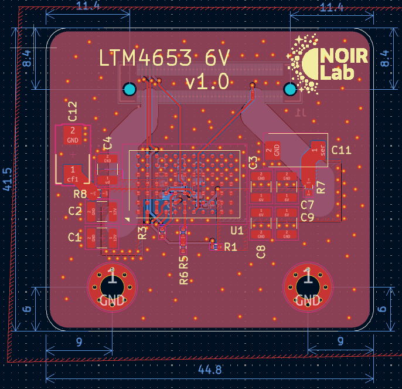
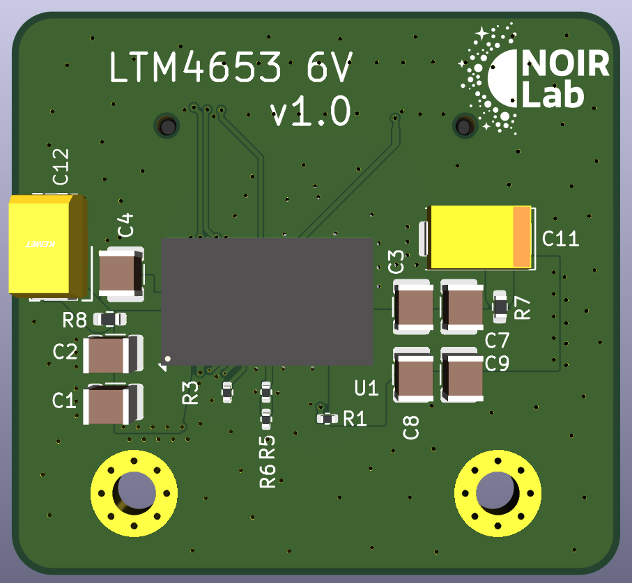

# mdc-power-p6-umodule
Modular Detector Controller Power 6V DC-DC uModule

## Overview
12V input to 6V output DC-DC module, 3A nominal output, used as one of the `mdc-power-*` bias rails.
Designed for 2.0 MHz sync operation.

## Power Stage
- Controller: `LTM4653` (`U1`)
  - Integrated µModule regulator including controller, MOSFETs, inductor, and support components.
  - Low-EMI µModule architecture suited for sensitive instrumentation rails.
  - EN55022B compliant regulator family (meets Class B EMI limits for conducted and radiated emissions).
  - Wide input range suitable for 12V systems.
  - Constant-frequency current-mode control.
  - Power good indicator and programmable soft-start.
  - External sync capability.

## Files
- Schematic: `power_p6_umodule.pdf`
- Simulation: `sim/` (LTspice and LTpowerCAD files used for loop and transient checks)

## Board Dimensions
- 44.8 mm x 41.5 mm

## Board Stackup
- 4-layer PCB

## Interface
- Control pins: `EN` (enable) and `PG` / `~PGOOD` (power good).
- Connector: `LSHM-140-04.0-L-DV-A-N-K-TR` (Samtec LSHM series) mezzanine for power and control signals.
  - Common pinout is shared across the 16V, -16V, 6V, and 3.3V variants.
  - Unused output rails are tied to GND on the specific module variant.

## Images
Layout:

3D view:

